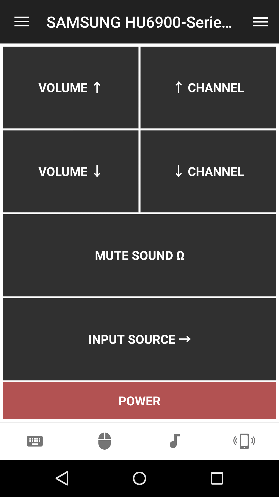

# SAMSUNG HU6900-Series (UIRT Remote)
Basic remote for the SAMSUNG UE55HU6905 TV over USB-UIRT

## Features
* Volume (up, down, mute)
* Switch Input Source
* Power (off/on)

## Screenshots

## Requirements
* A USB-UIRT device (http://www.usbuirt.com/)

## Setup
1. Install remote
2. Make sure that UIRT-USB works.
    https://www.unifiedremote.com/tutorials/how-to-install-usbuirt

## Support
Developed and maintained by **tkhduracell**
http://community.unifiedremote.com/topic/129/samsung-hu6900-series-uirt-remote